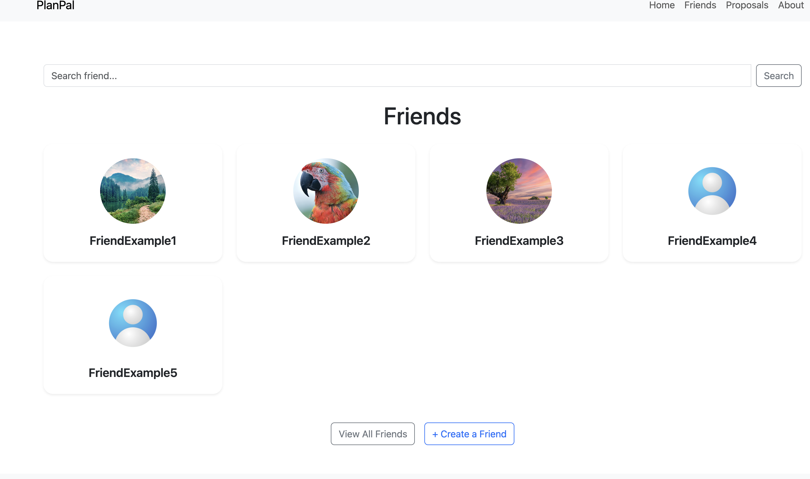
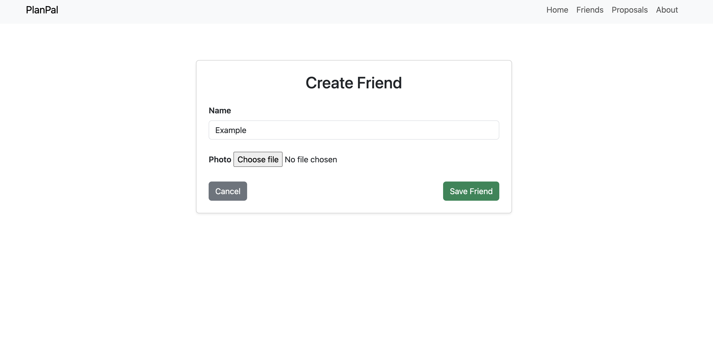
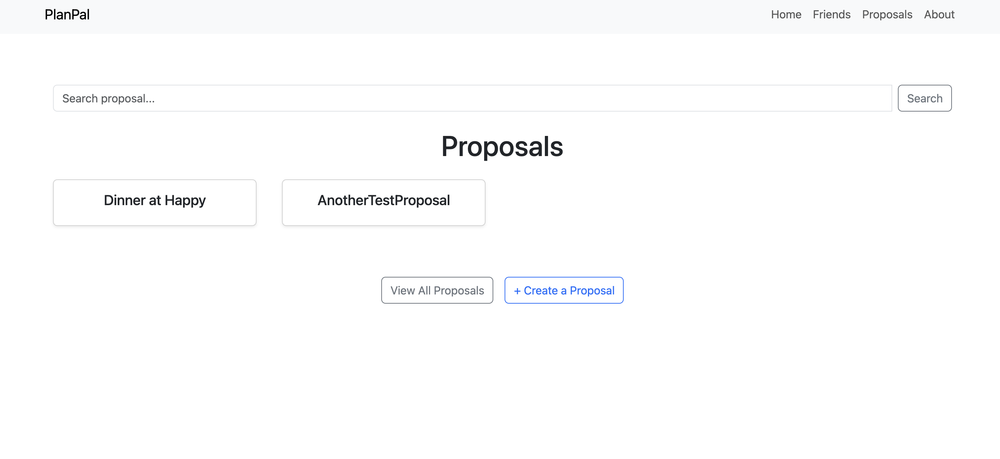
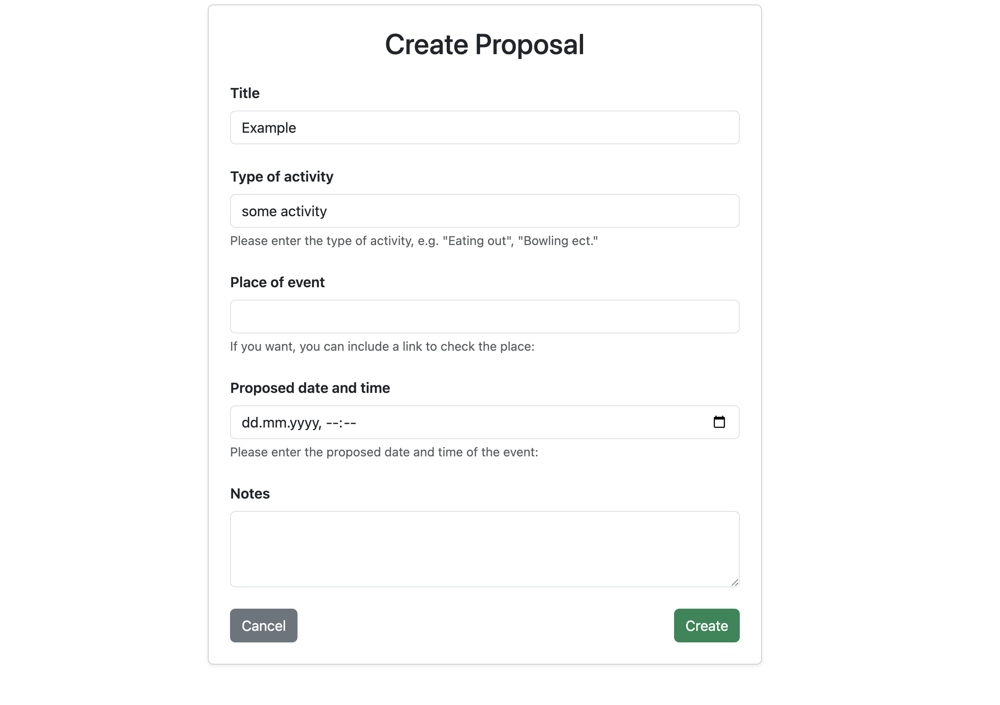
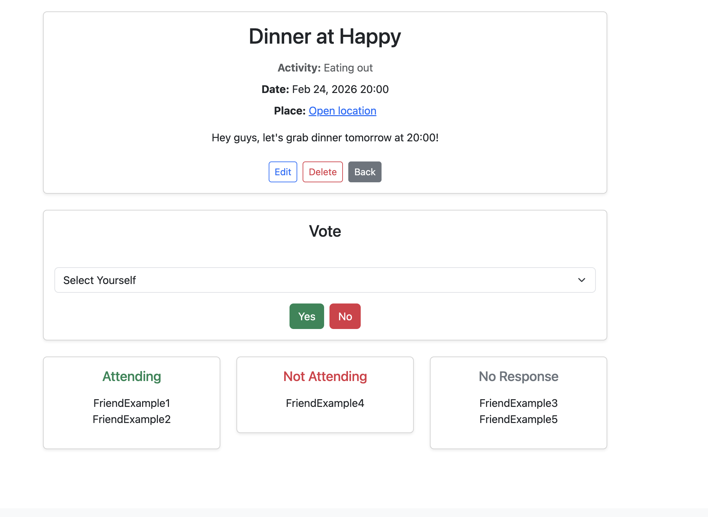
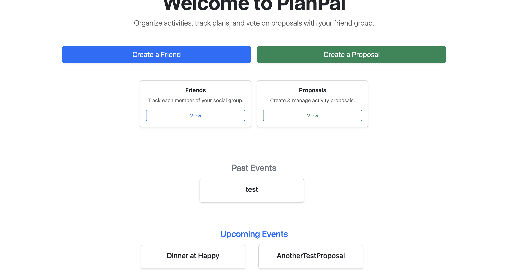

# PlanPal

PlanPal is a Django web application that helps a small group of friends organize activities, propose events, and vote on attendance in a clear and structured way.
The goal of the project is to replace messy group chats with a simple shared planner where everyone can instantly see what is planned and who is coming.

---

## ✨ Features

- Create and manage friends  
- Create, edit, and delete event proposals  
- Vote **Yes / No** for each proposal  
- Leave notes for clarifications  
- Automatic tracking of:
  - Attending
  - Not attending
  - No response  
- Dashboard with **Upcoming** and **Past** events - event are dynamically computed based on the current date, so the list always stays up-to-date
- Event date validation (cannot schedule events in the past)  
- Clean responsive UI built with Bootstrap 5  
- Custom 404 page
- Custom error messages

---

## 🧠 Concept

PlanPal is designed to be used by one social group of friends without authentication.
Instead of discussing plans endlessly in chat, one person creates a proposal:

> “Bowling on Friday at 19:00?”

Each friend selects themselves and votes.  
The system immediately shows who is coming and who is not.

This makes planning fast, transparent, and organized.

---

## 🏗 Data Model

Main entities:

- **Friend** — a member of the group  
- **Proposal** — an activity suggestion (time, place, notes)  
- **Vote** — a friend’s response to a proposal  

The home dashboard separates upcoming and past events for quick overview.

---

## 🛠 Tech Stack

- Python  
- Django  
- PostgreSQL  
- Bootstrap 5  

---

## ⚙️ Requirements

- Python 3.10+
- PostgreSQL installed and running

---

## ▶ Run Locally

### 1. Clone the repository
git clone https://github.com/KristiyanYanakiev/plan_pal.git
cd plan_pal

### 2. Create a virtual environment
python3 -m venv venv
source venv/bin/activate      # Linux / Mac \
venv\Scripts\activate         # Windows

### 3. Install dependencies
pip install -r requirements.txt

### 4. Setup environment variables
cp .env.example .env
### Then edit .env to configure your PostgreSQL credentials

### 5. Create PostgreSQL database matching DB_NAME
Example: create a database named 'plan_pal'

### 6. Apply migrations
python3 manage.py migrate

### 7. Create admin user
python3 manage.py createsuperuser

### 8. Run the development server
python3 manage.py runserver

### Open in your browser:
http://127.0.0.1:8000/

---

## 🔐 Environment Variables

| Variable      | Description |
|--------------|------------|
| DB_NAME      | PostgreSQL database name |
| DB_USER      | Database username |
| DB_PASSWORD  | Database password |
| DB_HOST      | Database host |
| DB_PORT      | Database port |

---

## 📦 Project Purpose

This project was built as a portfolio application demonstrating:

- Django models and relationships  
- Forms and validation  
- Function-based views  
- Business logic enforcement  
- Clean UI integration  
- Real-world problem-solving  

---

## Screenshots

### Friends List

### Create Friend

### Friends List

### Create Proposal

### Voting a Proposal

### Past and Upcoming events
